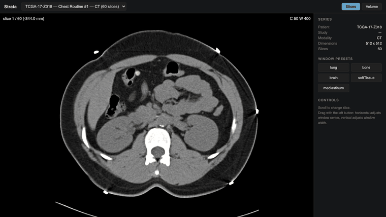

# strata

[](https://github.com/ethanstoner/strata/actions/workflows/ci.yml)
[](LICENSE)

**Open a folder of DICOM files in your browser. One binary, no PACS, no upload.**



*The real app on a public chest CT (TCGA-LUAD, CC BY 3.0): scroll the slices,
switch to the lung window, then rotate the GPU-raymarched 3D view.*

## Install

macOS and Linux:

```bash
curl --proto '=https' --tlsv1.2 -LsSf https://github.com/ethanstoner/strata/releases/latest/download/strata-installer.sh | sh
```

Windows (PowerShell):

```powershell
powershell -ExecutionPolicy Bypass -c "irm https://github.com/ethanstoner/strata/releases/latest/download/strata-installer.ps1 | iex"
```

Then:

```bash
strata ~/path/to/dicoms    # any folder of CT/MRI files, searched recursively
strata --demo              # or download a small public chest CT and open it
```

strata opens your browser at `http://127.0.0.1:8080`. It's a single ~9 MB
executable with the web UI compiled in, so there's nothing else to install.
Prebuilt binaries cover macOS (Apple Silicon and Intel), Linux x86_64, and
Windows x86_64. You can also download them directly from
[Releases](https://github.com/ethanstoner/strata/releases).

Your files stay on your machine. strata serves them only to your own browser
on `127.0.0.1` and makes no network requests, except `--demo`'s one-time
download of the sample study.

> **Not for clinical use.** strata is for research and education. It is not a
> medical device and must not be used for diagnosis or treatment decisions.

## How it compares

| | strata | [OHIF Viewer](https://github.com/OHIF/Viewers) | [3D Slicer](https://www.slicer.org/) |
| --- | --- | --- | --- |
| What you install | one ~9 MB binary | nothing for the hosted demo; a self-hosted copy is a web app you build (Node.js + Yarn) and serve | a desktop app: 269 MB (Windows) to 499 MB (Linux) download for 5.12.4 |
| Getting a folder on screen | `strata <folder>` | default deployments read from a DICOMweb server (e.g. Orthanc) you set up and load studies into; local-file loading is off in the default production config, though the [hosted demo](https://viewer.ohif.org/local) accepts dropped files | import the folder into its DICOM database (drag it in or use the DICOM module), then load the series |
| 3D | GPU raymarching in the browser | MPR and volume rendering | extensive: rendering, segmentation, registration, extensions |
| Best for | a quick look at a dataset on your own machine | a full web viewer for a PACS or archive | serious analysis and research workflows |

OHIF and Slicer do far more than strata. strata only tries to make the first
look at a folder of files take seconds instead of a setup session. Sizes and
requirements were checked in September 2026 against OHIF's
[default config](https://github.com/OHIF/Viewers/blob/master/platform/app/public/config/default.js)
and [developer docs](https://docs.ohif.org/development/getting-started/), and
Slicer's [download server](https://download.slicer.org/) and
[system requirements](https://slicer.readthedocs.io/en/latest/user_guide/getting_started.html).

Researchers, students, and ML engineers working with public imaging datasets
often fall back to plotting slices with matplotlib, which gives no windowing,
no scrolling, and no 3D. strata is for them.

## What it does

**Indexes** a directory by reading DICOM *headers only*, never pixel data, so
1026 files take 98 ms. Groups files into patients, studies, and series, and
derives the true 3D stacking order from each slice's recorded position.

**Serves** slices and downsampled volumes over HTTP as raw Hounsfield Units.


*A 60-slice chest CT from the public TCGA-LUAD collection, rendered at full
resolution in the browser. Bone transfer function, 180 HU threshold.*

**Renders** two ways:
- *Slice view* — scroll the stack, drag to window, five radiology presets
- *Volume view* — GPU raymarching with an editable transfer function, gradient
  lighting, MIP mode, and a pyramid selector so a modest laptop can load 1 MB
  instead of 64 MB

<p align="center">
  
  
</p>

*Left: lung window, showing pulmonary vasculature against air-filled lung.
Right: a 1026-slice abdominal study volume-rendered from the pyramid.*

## Engineering notes

The interesting problems in medical imaging are not rendering. They are the
ways a program can be confidently, silently wrong.

**Slice order comes from geometry, never `InstanceNumber`.** Each file records
its position and orientation in patient coordinates; the slice normal is the
cross product of the row and column direction cosines, and the sort key is the
position projected onto it. `InstanceNumber` is unreliable in real data, and
sorting by it produces a volume that renders perfectly and shows anatomy that
does not exist. No crash, no error — just a wrong answer that looks right.

**Non-finite values are rejected at the parse boundary.** `ImagePositionPatient`
is a decimal *string*, and `"nan"` parses to a valid `f64` without complaint. A
NaN sort key misplaces exactly one slice while every other slice sorts
correctly. An early version of `slice_normal` guarded with `magnitude < 1e-9`,
which fails open on NaN because `NaN < x` is `false` in IEEE-754.

**Hounsfield calibration is never fabricated.** CT values become physically
meaningful through `hu = raw × slope + intercept`. When those tags are absent
the data is not in Hounsfield Units, and `hu_calibrated` stays false all the way
to the UI. Notably `dicom-pixeldata`'s own rescale accessor silently substitutes
an identity slope and intercept when the tags are missing — strata reads tag
presence directly instead, so an uncalibrated series is reported as
uncalibrated rather than quietly presented as HU.

**A corrupt file does not fail a scan.** Per-file errors become warnings naming
the file. One bad file in a 10,000-file archive must not cost the other 9,999.

## Measured performance

Every number is output from `scripts/bench.ps1`. Nothing here is estimated.

**Hardware:** AMD Ryzen 9 9950X3D (16C/32T), 93.6 GB RAM, Windows 11.

| | 60-slice study | 1026-slice study |
| --- | --- | --- |
| Index (parse + group + order) | 4.8 ms | **97.8 ms** |
| Index rate | ~12,400 slices/sec | **~10,500 slices/sec** |
| Cold start to serving | — | 0.59 s |
| Slice fetch p50 | 6.32 ms | — |
| Volume, cold | — | **1.25 s** |
| Volume, warm in memory | — | 0.053 s |
| Volume, warm from disk after restart | — | **0.117 s** |
| Disk cache for the study | — | 65 MB |

Cold volume assembly began at 5.5 s. Decoding is embarrassingly parallel, so
slices decode across cores into indexed chunks — never pushed onto a shared
buffer, because slice order is the one invariant that must not be disturbed.
Assembled levels persist to disk, so the cost is paid once per study rather
than once per process.

Two decisions worth recording, both measured rather than assumed:

- **Unservable pyramid levels are never written to disk.** An earlier version
  cached level 0 for every study — for the large study that is a 513 MB file the
  size guard guarantees can never be served. The cache was bigger than the
  source data, 578 MB against 522 MB. Skipping levels over the guard brought it
  to 65 MB.
- **zstd was measured and rejected.** It compresses a level-1 payload from 67 MB
  to 38 MB, but adds 55–90 ms of decompression to a warm path that otherwise
  completes in ~0.12 s. A 50–80% latency penalty on an interactive viewer is not
  worth disk that is already bounded, so the dependency was removed.

## Known limits

Stated plainly rather than discovered later.

- **Full resolution is not servable for large studies.** A 1026-slice study is
  513 MB at level 0, past both the response guard and practical GPU 3D texture
  limits. The pyramid is mandatory, not an optimization.
- **The scanner table renders as anatomy.** Its ribbed core is dense enough to
  pass a bone threshold, so it appears as a striped slab beside the patient.
  This is faithful rendering of real data; clinical workstations solve it with
  table removal, which strata does not implement.
- **No annotation, segmentation, or measurement tools.**
- **No DIMSE / C-STORE networking.** Reads files from disk only.
- **Single user, no authentication.** Intended to run on your own machine.

## Scope

**For research and education.** Not a medical device, not FDA cleared, not
validated for diagnosis, and not HIPAA audited. Do not use it to make clinical
decisions.

## Architecture

```
DICOM directory
      │
      ▼
strata-dicom ──── headers only, no pixel decode
      │           group by SeriesInstanceUID, order by geometric depth
      ▼
strata-server ─── SQLite index (in memory), axum HTTP API, parallel decode,
      │           pyramid construction, bounded on-disk cache
      ▼
strata-web ────── slice view: int16 texture → isampler2D → shader windowing
                  volume view: R16F 3D texture → raymarcher → transfer function
                  (built by build.rs and compiled into the strata binary)
```

The two render paths deliberately differ. Slices use an integer texture so
Hounsfield values stay exact for future measurement work; the volume uses
`R16F` because integer textures are not filterable in WebGL2 and raymarching
without trilinear filtering aliases badly.

| Endpoint | |
| --- | --- |
| `GET /api/health` | status, series count, cache usage |
| `GET /api/series` | all series with dimensions and quality flags |
| `GET /api/series/:uid` | detail including per-slice depths and scan warnings |
| `GET /api/series/:uid/slices/:n` | one slice, raw little-endian `int16` |
| `GET /api/series/:uid/volume?level=N` | a pyramid level, raw little-endian `int16` |

## Demo data

`strata --demo` downloads one 60-slice chest CT series (about 17 MB) from
[The Cancer Imaging Archive](https://www.cancerimagingarchive.net/) through
its public REST API. No account is needed.

- **Collection:** TCGA-LUAD, series "Chest Routine 1",
  `1.3.6.1.4.1.14519.5.2.1.7777.9002.288863784292986419246212301446`
- **License:** [Creative Commons Attribution 3.0 Unported (CC BY 3.0)](https://creativecommons.org/licenses/by/3.0/),
  as stated by TCIA for this collection and in the LICENSE file inside the download
- **Citation:** Albertina, B., et al. (2016). The Cancer Genome Atlas Lung
  Adenocarcinoma Collection (TCGA-LUAD) (Version 4) [Data set]. The Cancer
  Imaging Archive. <https://doi.org/10.7937/K9/TCIA.2016.JGNIHEP5>
- **Usage policy:** [TCIA data usage policies](https://www.cancerimagingarchive.net/data-usage-policies-and-restrictions/)

The data is de-identified by TCIA. strata caches it in your OS cache directory
(`~/Library/Caches/strata` on macOS, `~/.cache/strata` on Linux,
`%LOCALAPPDATA%\strata` on Windows) and checks a SHA-256 checksum of the file
contents before using it, on every run. A download that fails the check is
deleted. Once cached, `--demo` works offline. If you're offline before the
first download, strata says so and exits.

For a larger study, `./scripts/fetch-sample.sh --size large` (or
`.\scripts\fetch-sample.ps1 -Size large` on Windows) fetches a ~500-slice
series from the same archive into `data/sample`.

## Building from source

You need Rust (stable) and Node.js 18+ with npm.

```bash
git clone https://github.com/ethanstoner/strata && cd strata
cargo build --release          # also builds the web UI and embeds it
./target/release/strata --demo
```

`crates/strata-server/build.rs` runs `npm ci` (first time only) and
`npm run build` for `web/`, then embeds the output in the binary. Two escape
hatches:

- `STRATA_WEB_DIST=/path/to/dist` embeds a UI you've already built.
- `STRATA_SKIP_WEB_BUILD=1` builds an API-only binary with a placeholder page.

For UI work, run `strata <folder> --addr 127.0.0.1:8099 --no-open` and
`cd web && npm run dev` (Vite proxies `/api` to port 8099).

## Testing

```bash
cargo test --workspace       # 75 pass, 7 more need real data (below)
cd web && npx vitest run     # 60 tests
```

DICOM fixtures are valid files generated programmatically at test time rather
than committed binaries, so each test declares exactly the malformation it
needs: shuffled instance numbers, absent tags, missing preamble, non-finite
positions, two series interleaved in one directory.

Tests requiring real imaging data are marked `#[ignore]`:

```bash
./scripts/fetch-sample.sh
cargo test -p strata-dicom --test real_data_test -- --ignored --nocapture
```

## Releasing

Releases are built by [cargo-dist](https://github.com/axodotdev/cargo-dist)
(`dist-workspace.toml`, `.github/workflows/release.yml`). Pushing a version
tag such as `v0.1.0` builds all four targets, creates the GitHub release, and
uploads the archives, checksums, and the shell/PowerShell installers.
`dist plan` shows what a release would contain.

## License

MIT
