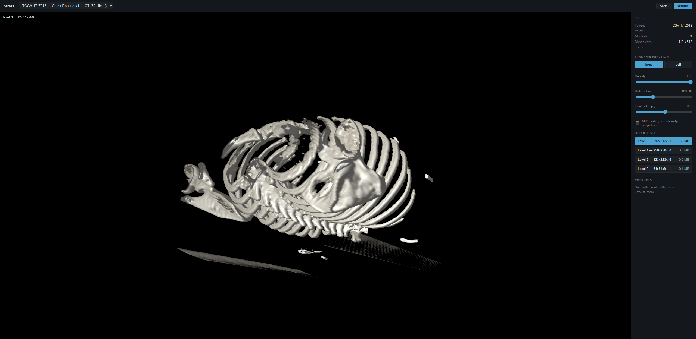
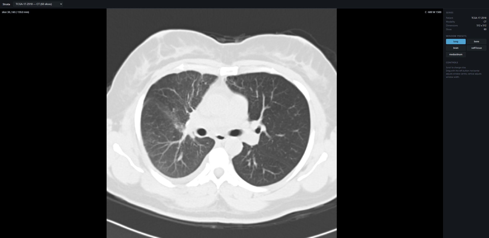
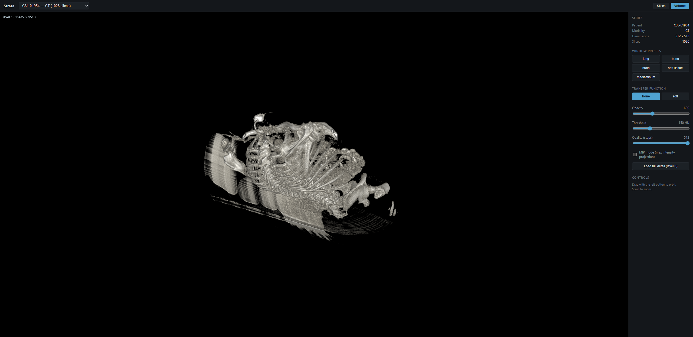

# strata

[](https://github.com/ethanstoner/strata/actions/workflows/ci.yml)
[](LICENSE)

**Open any DICOM study in your browser. One binary, one folder, no setup.**

Point strata at a directory of CT or MRI files and it gives you a radiology
workstation at `localhost` — scroll the slices, window the Hounsfield range,
or render the whole study in 3D on the GPU. No database to populate, no
DICOMweb server to stand up, no import step. It reads the files where they
already are.



*A 60-slice chest CT from the public TCGA-LUAD collection, rendered at full
resolution in the browser. Bone transfer function, 180 HU threshold.*

---

## Try it in about a minute

```bash
git clone https://github.com/ethanstoner/strata && cd strata
cargo build --release
cd web && npm install && npm run build && cd ..

./scripts/fetch-sample.sh          # real CT study, ~17 MB, no account needed
cargo run --release -p strata-server -- --data-dir data/sample
```

Open <http://127.0.0.1:8080>. On Windows use `.\scripts\fetch-sample.ps1`.

The sample fetcher pulls a genuine clinical study from the National Cancer
Institute's public archive. `--size large` gets a ~500-slice study if you want
to see the pyramid work.

## Why this exists

There is a real gap between *having* DICOM files and *looking* at them.

| | what it costs you |
| --- | --- |
| OHIF, the mature open-source viewer | requires Orthanc or another DICOMweb server, plus ingesting every study into it first |
| 3D Slicer, Horos, other desktop viewers | multi-gigabyte install, per machine, nothing you can share |
| Python and matplotlib | slice thumbnails, not a viewer — no windowing, no 3D, no scrolling |

Researchers, students, and ML engineers working with public imaging datasets
mostly end up doing the matplotlib thing, because standing up a PACS to glance
at one study is absurd. strata is for them.

## What it does

**Indexes** a directory by reading DICOM *headers only*, never pixel data, so
1026 files take 98 ms. Groups files into patients, studies, and series, and
derives the true 3D stacking order from each slice's recorded position.

**Serves** slices and downsampled volumes over HTTP as raw Hounsfield Units.

**Renders** two ways:
- *Slice view* — scroll the stack, drag to window, five radiology presets
- *Volume view* — GPU raymarching with an editable transfer function, gradient
  lighting, MIP mode, and a pyramid selector so a modest laptop can load 1 MB
  instead of 64 MB

<p align="center">
  
  
</p>

*Left: lung window, showing pulmonary vasculature against air-filled lung.
Right: a 1026-slice abdominal study volume-rendered from the pyramid.*

## Engineering notes

The interesting problems in medical imaging are not rendering. They are the
ways a program can be confidently, silently wrong.

**Slice order comes from geometry, never `InstanceNumber`.** Each file records
its position and orientation in patient coordinates; the slice normal is the
cross product of the row and column direction cosines, and the sort key is the
position projected onto it. `InstanceNumber` is unreliable in real data, and
sorting by it produces a volume that renders perfectly and shows anatomy that
does not exist. No crash, no error — just a wrong answer that looks right.

**Non-finite values are rejected at the parse boundary.** `ImagePositionPatient`
is a decimal *string*, and `"nan"` parses to a valid `f64` without complaint. A
NaN sort key misplaces exactly one slice while every other slice sorts
correctly. An early version of `slice_normal` guarded with `magnitude < 1e-9`,
which fails open on NaN because `NaN < x` is `false` in IEEE-754.

**Hounsfield calibration is never fabricated.** CT values become physically
meaningful through `hu = raw × slope + intercept`. When those tags are absent
the data is not in Hounsfield Units, and `hu_calibrated` stays false all the way
to the UI. Notably `dicom-pixeldata`'s own rescale accessor silently substitutes
an identity slope and intercept when the tags are missing — strata reads tag
presence directly instead, so an uncalibrated series is reported as
uncalibrated rather than quietly presented as HU.

**A corrupt file does not fail a scan.** Per-file errors become warnings naming
the file. One bad file in a 10,000-file archive must not cost the other 9,999.

## Measured performance

Every number is output from `scripts/bench.ps1`. Nothing here is estimated.

**Hardware:** AMD Ryzen 9 9950X3D (16C/32T), 93.6 GB RAM, Windows 11.

| | 60-slice study | 1026-slice study |
| --- | --- | --- |
| Index (parse + group + order) | 4.8 ms | **97.8 ms** |
| Index rate | ~12,400 slices/sec | **~10,500 slices/sec** |
| Cold start to serving | — | 0.59 s |
| Slice fetch p50 | 6.32 ms | — |
| Volume, cold | — | **1.25 s** |
| Volume, warm in memory | — | 0.053 s |
| Volume, warm from disk after restart | — | **0.117 s** |
| Disk cache for the study | — | 65 MB |

Cold volume assembly began at 5.5 s. Decoding is embarrassingly parallel, so
slices decode across cores into indexed chunks — never pushed onto a shared
buffer, because slice order is the one invariant that must not be disturbed.
Assembled levels persist to disk, so the cost is paid once per study rather
than once per process.

Two decisions worth recording, both measured rather than assumed:

- **Unservable pyramid levels are never written to disk.** An earlier version
  cached level 0 for every study — for the large study that is a 513 MB file the
  size guard guarantees can never be served. The cache was bigger than the
  source data, 578 MB against 522 MB. Skipping levels over the guard brought it
  to 65 MB.
- **zstd was measured and rejected.** It compresses a level-1 payload from 67 MB
  to 38 MB, but adds 55–90 ms of decompression to a warm path that otherwise
  completes in ~0.12 s. A 50–80% latency penalty on an interactive viewer is not
  worth disk that is already bounded, so the dependency was removed.

## Known limits

Stated plainly rather than discovered later.

- **Full resolution is not servable for large studies.** A 1026-slice study is
  513 MB at level 0, past both the response guard and practical GPU 3D texture
  limits. The pyramid is mandatory, not an optimisation.
- **The scanner table renders as anatomy.** Its ribbed core is dense enough to
  pass a bone threshold, so it appears as a striped slab beside the patient.
  This is faithful rendering of real data; clinical workstations solve it with
  table removal, which strata does not implement.
- **No annotation, segmentation, or measurement tools.**
- **No DIMSE / C-STORE networking.** Reads files from disk only.
- **Single user, no authentication.** Intended to run on your own machine.

## Scope

**For research and education.** Not a medical device, not FDA cleared, not
validated for diagnosis, and not HIPAA audited. Do not use it to make clinical
decisions.

## Architecture

```
DICOM directory
      │
      ▼
strata-dicom ──── headers only, no pixel decode
      │           group by SeriesInstanceUID, order by geometric depth
      ▼
strata-server ─── SQLite index, axum HTTP API, parallel decode,
      │           pyramid construction, bounded on-disk cache
      ▼
strata-web ────── slice view: int16 texture → isampler2D → shader windowing
                  volume view: R16F 3D texture → raymarcher → transfer function
```

The two render paths deliberately differ. Slices use an integer texture so
Hounsfield values stay exact for future measurement work; the volume uses
`R16F` because integer textures are not filterable in WebGL2 and raymarching
without trilinear filtering aliases badly.

| Endpoint | |
| --- | --- |
| `GET /api/health` | status, series count, cache usage |
| `GET /api/series` | all series with dimensions and quality flags |
| `GET /api/series/:uid` | detail including per-slice depths and scan warnings |
| `GET /api/series/:uid/slices/:n` | one slice, raw little-endian `int16` |
| `GET /api/series/:uid/volume?level=N` | a pyramid level, raw little-endian `int16` |

## Testing

```bash
cargo test --workspace       # 65 pass, 7 more need real data (below)
cd web && npx vitest run     # 60 tests
```

DICOM fixtures are valid files generated programmatically at test time rather
than committed binaries, so each test declares exactly the malformation it
needs — shuffled instance numbers, absent tags, missing preamble, non-finite
positions, two series interleaved in one directory.

Tests requiring real imaging data are marked `#[ignore]`:

```bash
./scripts/fetch-sample.sh
cargo test -p strata-dicom --test real_data_test -- --ignored --nocapture
```

## License

MIT
