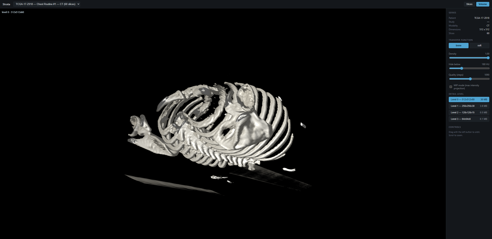
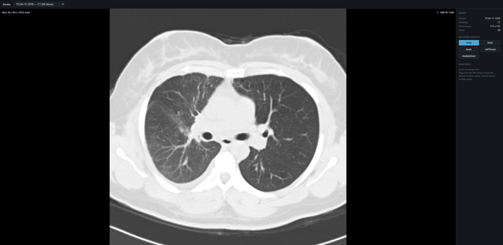
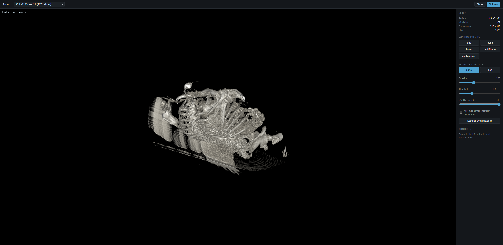

# strata

[](https://github.com/ethanstoner/strata/actions/workflows/ci.yml)
[](LICENSE)

**A DICOM viewer in one Rust binary: point it at a folder of CT or MRI files
and browse the study in your browser, in 2D or GPU volume rendering, with no
server to stand up and no import step.**



*A 60-slice chest CT from the public TCGA-LUAD collection, raymarched at full
resolution in the browser. Bone transfer function, 180 HU threshold.*

### Highlights

- Indexes a 1,026-slice, 517 MB CT study in **~100 ms** by reading DICOM
  headers only, never pixel data
- Cut cold volume assembly on that study from **5.1 s to 1.07 s** with
  parallel decode; an on-disk pyramid cache serves it in **0.09 s** after a restart
- A four-level volume pyramid lets a modest laptop load **1 MB instead of
  64 MB** of the same study; the 513 MB full-resolution volume is refused
  cleanly instead of crashing the GPU
- **129 automated tests** (69 Rust, 60 TypeScript) on generated malformed
  DICOM fixtures, plus 7 that run against real public studies

**Rust · axum · SQLite · rayon · dicom-rs · TypeScript · WebGL2 · Vite**

---

## Overview

There is a real gap between *having* DICOM files and *looking* at them.

| | what it costs you |
| --- | --- |
| OHIF, the mature open-source viewer | requires Orthanc or another DICOMweb server, plus ingesting every study into it first |
| 3D Slicer, Horos, other desktop viewers | multi-gigabyte install, per machine, nothing you can share |
| Python and matplotlib | slice thumbnails, not a viewer: no windowing, no 3D, no scrolling |

Researchers, students, and ML engineers working with public imaging datasets
mostly end up doing the matplotlib thing, because standing up a PACS to glance
at one study is absurd. strata is for them. It reads the files where they
already are and serves a viewer at `localhost`:

- **Slice view:** scroll the stack, drag to window the Hounsfield range, five
  radiology presets (lung, bone, brain, soft tissue, mediastinum)
- **Volume view:** GPU raymarching with an editable transfer function,
  gradient lighting, MIP mode, and a pyramid level selector

<p align="center">
  
  
</p>

*Left: lung window, showing pulmonary vasculature against air-filled lung.
Right: a 1,026-slice abdominal study volume-rendered from the pyramid.*

## Architecture

```
DICOM directory
      │
      ▼
strata-dicom ──── headers only, no pixel decode
      │           group by SeriesInstanceUID, order by geometric depth
      ▼
strata-server ─── SQLite index, axum HTTP API, parallel decode,
      │           pyramid construction, bounded on-disk cache
      ▼
strata-web ────── slice view: int16 texture → isampler2D → shader windowing
                  volume view: R16F 3D texture → raymarcher → transfer function
```

The two render paths deliberately differ. Slices use an integer texture so
Hounsfield values stay exact; the volume uses `R16F` because integer textures
are not filterable in WebGL2, and raymarching without trilinear filtering
aliases badly.

| Endpoint | |
| --- | --- |
| `GET /api/health` | status, series count, cache usage |
| `GET /api/series` | all series with dimensions and quality flags |
| `GET /api/series/:uid` | detail including per-slice depths and scan warnings |
| `GET /api/series/:uid/slices/:n` | one slice, raw little-endian `int16` |
| `GET /api/series/:uid/volume?level=N` | a pyramid level, raw little-endian `int16` |

## Engineering Highlights

The interesting problems in medical imaging are not rendering. They are the
ways a program can be confidently, silently wrong.

- **Ordered slices by patient-space geometry, never `InstanceNumber`.** The
  slice normal is the cross product of the row and column direction cosines,
  and the sort key is each slice's position projected onto it.
  `InstanceNumber` is unreliable in real data, and sorting by it produces a
  volume that renders perfectly and shows anatomy that does not exist. A
  series whose slices face different directions (a swept-in localizer, a
  multi-group MR acquisition) has no stacking axis, so it is flagged with a
  warning and not treated as a volume.
- **Rejected non-finite values at the parse boundary.** `ImagePositionPatient`
  is a decimal *string*, and `"nan"` parses to a valid `f64`. A NaN sort key
  misplaces exactly one slice while every other slice sorts correctly. An
  early `slice_normal` guard of `magnitude < 1e-9` failed open on NaN, because
  `NaN < x` is `false` in IEEE-754.
- **Never fabricated Hounsfield calibration.** `dicom-pixeldata`'s rescale
  accessor silently substitutes an identity slope and intercept when the tags
  are missing. strata reads tag presence directly, so an uncalibrated series
  reaches the UI as `hu_calibrated: false` instead of being presented as HU.
- **Parallelised slice decode: 5.1 s to 1.07 s** for a cold 64 MB pyramid
  level of the 1,026-slice study. Slices decode across cores with rayon into
  ordinal-indexed chunks, never a shared buffer, because slice order is the
  one invariant that must not be disturbed. A test checks the parallel output
  is byte-identical to a sequential decode.
- **Measured before cascading the pyramid.** Building level 2 from level 1
  instead of from level 0 does about 8x less work; on the 1,026-slice study
  the two differ by at most 1 HU (mean 0.09 HU over 4.2M voxels), so every
  level cascades.
- **Stopped the cache outgrowing the data.** Level 0 of the large study is
  513 MB and can never be served, yet an earlier version cached it, making the
  cache bigger than the 517 MB source. Unservable levels now stay in memory
  only; all three servable levels together take 73 MB on disk, under an LRU
  byte budget.
- **Kept per-file failures local.** A corrupt file becomes a warning naming
  the file, not a failed scan, so one bad file does not cost the rest of the
  archive.

### Measured performance

Numbers from `scripts/bench.ps1` (indexing, slice fetch) and `curl` timings
against the release server (volume, cold start), each repeated across runs.
AMD Ryzen 9 9950X3D (16C/32T), 93.6 GB RAM, Windows 11 Pro. Sizes in MiB.

| | 60-slice chest CT | 1,026-slice abdominal CT |
| --- | --- | --- |
| Index (parse + group + order, warm OS cache) | ~5.5 ms | **~100 ms** |
| Index rate | ~11,000 slices/sec | **~10,400 slices/sec** |
| Process start to serving | | 0.57 s |
| Slice fetch p50 | 6.5 ms | |
| Level 1 volume (256×256×513, 64 MB), cold (not yet assembled) | | **1.07 s** |
| Level 1 volume, warm in memory | | 0.05 s |
| Level 1 volume, warm from disk after restart | | **0.09 s** |
| Disk cache after levels 1-3 | | 73 MB |

zstd was measured and rejected for the disk cache. It shrinks the level 1
payload from 64 MB to 29-36 MB, but decompression alone costs 24-53 ms against
a warm-from-disk path of about 90 ms. That latency is not worth it for a cache
that is already bounded.

## Getting Started

Requires Rust and Node 20+.

```bash
git clone https://github.com/ethanstoner/strata && cd strata
cargo build --release
cd web && npm install && npm run build && cd ..

./scripts/fetch-sample.sh          # real CT study, ~17 MB download, no account needed
cargo run --release -p strata-server -- --data-dir data/sample
```

Open <http://127.0.0.1:8080>. On Windows use `.\scripts\fetch-sample.ps1`.
The fetcher pulls a public clinical study from the National Cancer Institute's
TCIA archive; `--size large` gets a ~500-slice study that exercises the pyramid.

## Testing

```bash
cargo test --workspace       # 69 pass; 7 more need real data (below)
cd web && npm test           # 60 pass
```

DICOM fixtures are valid files generated at test time rather than committed
binaries, so each test declares exactly the malformation it needs: shuffled
instance numbers, absent tags, missing preamble, non-finite positions, mixed
slice orientations, two series interleaved in one directory.

Tests needing real imaging data are marked `#[ignore]`. Six run against the
default sample; `level2_cascade_error_vs_direct_from_level0` needs the
1,026-slice study (CPTAC-CCRCC) in `data/big`:

```bash
./scripts/fetch-sample.sh
./scripts/fetch-sample.sh --out-dir data/big --collection CPTAC-CCRCC \
  --series-uid 1.3.6.1.4.1.14519.5.2.1.6450.2626.154966562989640574627543147474
cargo test --workspace -- --ignored --nocapture
```

## Known limits and scope

- **Full resolution is not servable for large studies.** Level 0 of the
  1,026-slice study is 513 MB, past both the response guard and practical GPU
  3D texture limits. The pyramid is mandatory, not an optimisation.
- **The scanner table renders as anatomy.** Its ribbed core is dense enough to
  pass a bone threshold. That is faithful rendering of real data; clinical
  workstations remove the table, and strata does not.
- **No annotation, segmentation, or measurement tools. No DIMSE / C-STORE
  networking.** It reads files from disk only.
- **Single user, no authentication.** Intended to run on your own machine.
- **For research and education.** Not a medical device, not FDA cleared, not
  validated for diagnosis, and not HIPAA audited. Do not use it to make
  clinical decisions.

## What I Learned

- **Measure the measuring tool.** The first slice benchmark read over 250 ms
  per request. Almost all of it was PowerShell's `Invoke-WebRequest`, which
  opens a new connection and parses every body; `curl` with keep-alive
  measures the same endpoint at about 6.5 ms. The harness now uses a
  kept-alive `HttpClient`, and every number in this README comes from a
  script or a repeatable `curl` run.
- **The dangerous bugs here don't crash.** A wrong slice order, a NaN that
  slips past a `<` guard, and a library quietly defaulting a missing rescale
  all produce images that look right. The fix each time was to make the
  invariant explicit at the boundary and write a fixture that breaks it,
  including one where orientation had been parsed for every slice and never
  checked.
- **Caching can cost more than it saves.** Persisting every pyramid level
  made the cache larger than the study it was caching, and compressing it
  would have traded 64 MB of disk for up to 60% more latency. Both were
  caught by measuring, not by reasoning about it.

## License

MIT
